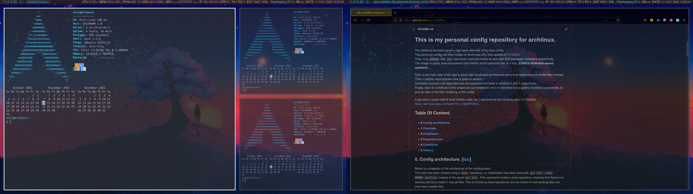
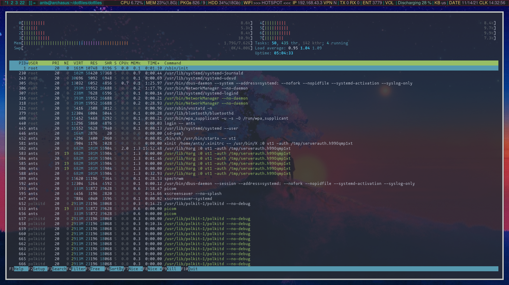
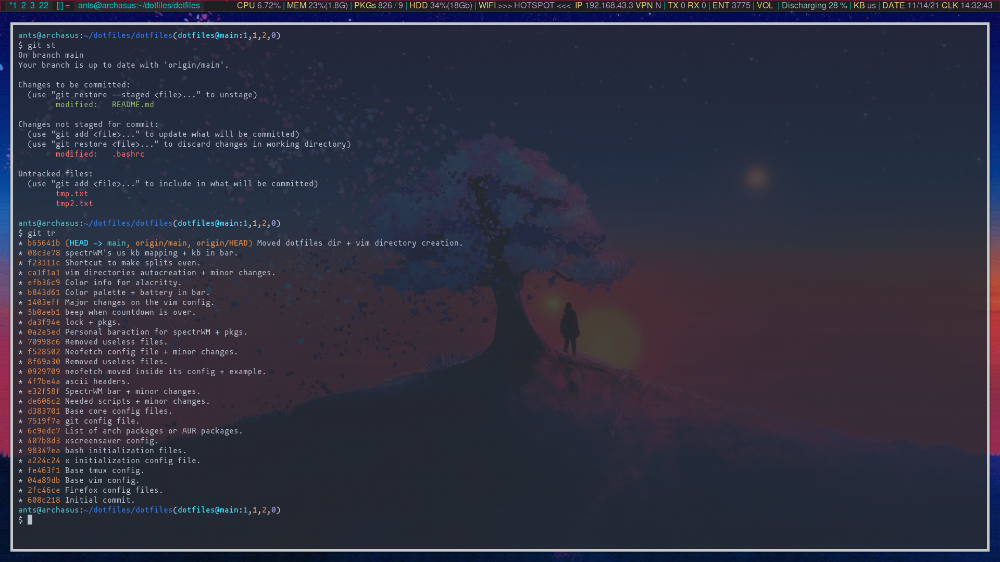

# This is my personal config repository for archlinux.
The following document gives a high level overview of my linux config.  
This particular config has been tested on ArchLinux only (last update on 11/14/21).  
Thus, only `pacman` and `yay` have been used and tested as arch and AUR packages managers respectively.  
The reader is highly adviced to search the internet and in particular the [ArchWiki](https://archlinux.org/), **EVEN in NON arch-based systems!!**

First, an overview of the repo is given with the project architecture and a brief explaination of all the files involved in [section 1](https://github.com/a2n-s/dotfiles/tree/main/#1-overview-and-architecture-toc).  
Installation process and dependencies are explained and listed in [sections 2](https://github.com/a2n-s/dotfiles/tree/main/#2-installation-toc) and [section 3](https://github.com/a2n-s/dotfiles/tree/main/#3-dependencies-toc) respectively.  
Finally, ways to contribute to this project are put forward in [section 4](https://github.com/a2n-s/dotfiles/tree/main/#4-contribute-toc) for who is interested and a gallery of photos is presented in [section 5](https://github.com/a2n-s/dotfiles/tree/main/#5-gallery-toc), 
to give an idea of the final rendering of the config.  

If you want a quick brief of what dotfiles really are, I recommend the following video of *FireShip*: https://www.youtube.com/watch?v=r_MpUP6aKiQ.

## Table Of Content.
- **1** [**Overview and architecture.**](https://github.com/a2n-s/dotfiles/tree/main/#1-overview-and-architecture-toc)
- **2** [**Installation.**](https://github.com/a2n-s/dotfiles/tree/main/#2-installation-toc)
- **3** [**Dependencies.**](https://github.com/a2n-s/dotfiles/tree/main/#3-dependencies-toc)
- **4** [**Contribute.**](https://github.com/a2n-s/dotfiles/tree/main/#4-contribute-toc)
- **5** [**Gallery.**](https://github.com/a2n-s/dotfiles/tree/main/#5-gallery-toc)

## 1. Overview and architecture. [[toc](https://github.com/a2n-s/dotfiles/tree/main/#table-of-content)]
Below is a snapshot of the architecture of the config project.  
This repo has been created using a `bare` repository, i.e. initialization has been done with `git init --bare $HOME/.dotfiles` instead of the
usual `git init`.  This command creates a *bare* repository, meaning that there is no working directory inside it, only git files.
This is normal as *bare* repositories are not meant to host working files, but only track outside files.  
This makes the process of tracking *dotfiles* much easier! There is no need anymore to copy files into the *dotfiles* repository, track them
and put them back where they should be using symlinks! A simple `alias` of the form `cfg='/usr/bin/git --git-dir=$HOME/.dotfiles/ --work-tree=$HOME'`
is enough.

Hence, the architecture below is a perfect mirror, regarding tracked files only, of my system!  

Notes:
- simply replace $HOME with whatever your personal space is called. One can issue `echo $HOME` in a terminal to check this.
- flags are given right before file names -> **[d]** indicates a directory and **[-]** a file.

If you want more information about *bare* `git` repositories, you can check one of the following resources:
- https://www.atlassian.com/git/tutorials/dotfiles: a blog post about *bare* repositories.
- https://www.youtube.com/watch?v=tBoLDpTWVOM&t=879s: if you want to see the creation of such a repository step by step.
```
$HOME
|-- [d] .config                     -- main config directory
|   |-- [d] alacritty                 --  the alacritty terminal emulator.
|   |   `-- [-] alacritty.yml
|   |-- [d] cmus                      --  my favorite music player based on ncurses.
|   |   |-- [-] autosave
|   |   `-- [-] lib.pl
|   |-- [d] htop                      -- my process monitor.
|   |   `-- [-] htoprc
|   |-- [d] neofetch                  -- my logo printer. 
|   |   `-- [-] config.conf
|   |-- [d] nitrogen                  -- my wallpaper manager. 
|   |   `-- [-] nitrogen.cfg
|   `-- [d] spectrwm                  -- the spectrWM tilling window manager.
|       |-- [-] spectrwm.conf
|       |-- [-] spectrwm_fr.conf
|       `-- [-] spectrwm_us.conf
|-- [d] .pkgslists                  -- packages.
|   |-- [-] allpkglist.txt            -- the list of all installed packages.
|   |-- [-] foreignpkglist.txt        -- the list of AUR packages.
|   |-- [-] optdeplist.txt            -- the list of optional packages.
|   `-- [-] pkglist.txt               -- the list of arch packages.
|-- [d] scripts                     -- my scripts. 
|    |-- [-] screenshot.sh            -- takes screeshots with scrot.
|    |-- [-] spectrWM-baraction.sh    -- controls the spectrWM bar.
|    |-- [-] togkb.sh                 -- toggles the keyboard layout.
|    |-- [-] wvenv                    -- shows current python environment.
|    `-- [-] xtcl                     -- disables my broken caps lock key.
|-- [-] .bash_aliases               -- all my command aliases.
|-- [-] .bash_logout                -- what bash should do on logout.
|-- [-] .bash_profile               -- runs bash and starts the WM on startup.
|-- [-] .bashrc                     -- runs config stuff to make the experience what it is.
|-- [-] .gitconfig                  -- all my git config.
|-- [-] .profile                    -- profile script.
|-- [-] .tmux.conf                  -- my tmux config file.
|-- [-] .vimrc                      -- all needed configuration for a pretty vim.
|-- [-] .xinitrc                    -- what to do when x starts.
|-- [-] .xscreensaver               -- my config when the machine is idle or manually locked.
`-- [-] README.md
```

## 2. Installation. [[toc](https://github.com/a2n-s/dotfiles/tree/main/#table-of-content)]
For now, the only way to install my config is to manually:
- backup your config files.
- copy mine in replacement.

For instance, let us say that you want to replace your `vim` config with mine, you can either go to the section below
or directly:
- clone the repo with `git clone https://github.com/a2n-s/dotfiles.git` or `git clone git@github.com:a2n-s/dotfiles.git`.
- place your version of the `.vimrc` file inside a backup directory or archive.
- copy my `.vimrc` file in replacement of yours.
- follow additional instructions in the dedicated section ([here](https://github.com/a2n-s/dotfiles/tree/main/#install-vim-toc) for `vim`).
- enjoy your new `vim` experience!

I will try, in the future, to provide an `install.sh` script to (1) select what part of the config to install,
(2) backup the choosen files of the user inside a safe place and (3) install my config files in replacement.  
I also plan to develop an `uninstall.sh` script that does the exact inverse to restore the config of the user
just as it was before the installation.

List of manual installation processes:
- [alacritty](https://github.com/a2n-s/dotfiles/tree/main/#install-alacritty-toc)
- [bash](https://github.com/a2n-s/dotfiles/tree/main/#install-bash-toc)
- [git](https://github.com/a2n-s/dotfiles/tree/main/#install-git-toc)
- [htop](https://github.com/a2n-s/dotfiles/tree/main/#install-htop-toc)
- [neofetch](https://github.com/a2n-s/dotfiles/tree/main/#install-neofetch-toc)
- [nitrogen](https://github.com/a2n-s/dotfiles/tree/main/#install-nitrogen-toc)
- [spectrWM](https://github.com/a2n-s/dotfiles/tree/main/#install-spectrWM-toc)
- [tmux](https://github.com/a2n-s/dotfiles/tree/main/#install-tmux-toc)
- [vim](https://github.com/a2n-s/dotfiles/tree/main/#install-vim-toc)
- [x](https://github.com/a2n-s/dotfiles/tree/main/#install-x-toc)
- [xscreensaver](https://github.com/a2n-s/dotfiles/tree/main/#install-xscreensaver-toc)

### Install alacritty. [[toc](https://github.com/a2n-s/dotfiles/tree/main/#table-of-content)]
- install the dependencies in [alacritty](https://github.com/a2n-s/dotfiles/tree/main/#dependencies-for-alacritty-toc).
- install the `alacritty` command.
- copy [`alacritty.yml`] inside your `~/.config/alacritty` directory.
### Install bash. [[toc](https://github.com/a2n-s/dotfiles/tree/main/#table-of-content)]
- install the dependencies in [bash](https://github.com/a2n-s/dotfiles/tree/main/#dependencies-for-bash-toc).
- copy [`.bash_aliases`], [`.bash_logout`], [`.bash_profile`], [`.bashrc`] and [`.profile`] inside your `~/` directory.
### Install git. [[toc](https://github.com/a2n-s/dotfiles/tree/main/#table-of-content)]
- install the `git` command.
- copy [`.gitconfig`] inside your `~/` directory.
### Install htop. [[toc](https://github.com/a2n-s/dotfiles/tree/main/#table-of-content)]
- install the `htop` command.
- copy [`htoprc`] inside your `~/.config/htop` directory.
### Install neofetch. [[toc](https://github.com/a2n-s/dotfiles/tree/main/#table-of-content)]
- install the dependencies in [neofetch](https://github.com/a2n-s/dotfiles/tree/main/#dependencies-for-neofetch-toc).
- install the `neofetch` command.
- copy [`config.conf`] inside your `~/.config/neofetch` directory.
### Install nitrogen. [[toc](https://github.com/a2n-s/dotfiles/tree/main/#table-of-content)]
- install the dependencies in [nitrogen](https://github.com/a2n-s/dotfiles/tree/main/#dependencies-for-nitrogen-toc).
- install the `nitrogen` command.
- copy [`nitrogen.cfg`] inside your `~/.config/nitrogen` directory.
### Install spectrWM. [[toc](https://github.com/a2n-s/dotfiles/tree/main/#table-of-content)]
- install the dependencies in [spectrWM](https://github.com/a2n-s/dotfiles/tree/main/#dependencies-for-spectrWM-toc).
- install the `spectrwm` command.
- copy [`spectrwm.conf`] and [`spectrwm_us.conf`] inside your `~/.config/spectrwm` directory.
### Install tmux. [[toc](https://github.com/a2n-s/dotfiles/tree/main/#table-of-content)]
- install the `tmux` command.
- copy [`tmux.conf`] inside your `~/` directory.
### Install vim. [[toc](https://github.com/a2n-s/dotfiles/tree/main/#table-of-content)]
- install the dependencies in [vim](https://github.com/a2n-s/dotfiles/tree/main/#dependencies-for-vim-toc).
- install the `vim` command.
- copy [`.vimrc`] inside your `~/` directory.
### Install x. [[toc](https://github.com/a2n-s/dotfiles/tree/main/#table-of-content)]
- install the dependencies in [x](https://github.com/a2n-s/dotfiles/tree/main/#dependencies-for-x-toc).
- install the `x` package.
- copy [`.xinitrc`] inside your `~/` directory.
### Install xscreensaver. [[toc](https://github.com/a2n-s/dotfiles/tree/main/#table-of-content)]
- install the `xscreensaver` command.
- copy [`.xscreensaver`] inside your `~/` directory.

## 3. Dependencies. [[toc](https://github.com/a2n-s/dotfiles/tree/main/#table-of-content)]
In this config, some part, i.e. commands and programs like window managers or text editors, requires some dependencies.  
To install dependencies, one has two options:
- install them by hand, individually -> use `pacman -F <command>` or `yay -F <command>` to find the name of the package
containing the command. Then issue `pacman -S <package>` or `yay -S <package>` to install them.
- install all the packages I have on my system by using the lists in [`pkgslists`] and `pacman` or `yay` to install them.

List of commands dependencies:
- [alacritty](https://github.com/a2n-s/dotfiles/tree/main/#dependencies-for-alacritty-toc)
- [bash](https://github.com/a2n-s/dotfiles/tree/main/#dependencies-for-bash-toc)
- [neofetch](https://github.com/a2n-s/dotfiles/tree/main/#dependencies-for-neofetch-toc)
- [nitrogen](https://github.com/a2n-s/dotfiles/tree/main/#dependencies-for-nitrogen-toc)
- [spectrWM](https://github.com/a2n-s/dotfiles/tree/main/#dependencies-for-spectrwm-toc)
- [vim](https://github.com/a2n-s/dotfiles/tree/main/#dependencies-for-vim-toc)
- [x](https://github.com/a2n-s/dotfiles/tree/main/#dependencies-for-x-toc)

List of scripts dependencies:
- [screenshot.sh](https://github.com/a2n-s/dotfiles/tree/main/#dependencies-for-screenshotsh-toc)
- [spectrWM-baraction.sh](https://github.com/a2n-s/dotfiles/tree/main/#dependencies-for-spectrwm-baractionsh-toc)
- [togkb.sh](https://github.com/a2n-s/dotfiles/tree/main/#dependencies-for-togkb-sh-toc)
- [wvenv](https://github.com/a2n-s/dotfiles/tree/main/#dependencies-for-wvenv-toc)
- [xtcl](https://github.com/a2n-s/dotfiles/tree/main/#dependencies-for-xtcl-toc)

### Dependencies for alacritty. [[toc](https://github.com/a2n-s/dotfiles/tree/main/#table-of-content)]
- `xterm-256color` mode to display many colors.u
- the `mononoki nerd font`: can be installed with `yay -S nerd-fonts-mononoki`
### Dependencies for bash. [[toc](https://github.com/a2n-s/dotfiles/tree/main/#table-of-content)]
- the scripts in [`scripts`].
- `neofetch`, `git` and `cal`.
### Dependencies for neofetch. [[toc](https://github.com/a2n-s/dotfiles/tree/main/#table-of-content)]
- some art works
- an optional `.neofetchrc` file -> see [`.basrc`].
### Dependencies for nitrogen. [[toc](https://github.com/a2n-s/dotfiles/tree/main/#table-of-content)]
- some wallpapers to load and restore.
- mine currently is a [vibrant scene](https://voyage-onirique.com/wp-content/uploads/2020/03/backiee-138908-landscape-scaled.jpg).
### Dependencies for spectrWM. [[toc](https://github.com/a2n-s/dotfiles/tree/main/#table-of-content)]
- the `mononoki nerd` font.
- a [`spectrWM-baraction.sh`] file.
- a browser: `firefox`
- a menu: `dmenu`
- a terminal: `alacritty`
- an email application: `thunderbird`
- a rendering service: `arandr`
- an image editor: `gimp`. I also use `kolourpaint`
- `brightnessctl` to control the brightness of the main screen.
- `amixer` to control the volume of the main screen.
- [`togkb.sh`] to switch the keyboard layout.
- `xscreensaver` to lock and save the screen usage.
### Dependencies for vim. [[toc](https://github.com/a2n-s/dotfiles/tree/main/#table-of-content)]
- make sure to either run `vim` once with the `.vimrc` file installed or issue `mkdir -p ~/.vim ~/.vim/autoload ~/.vim/backup ~/.vim/color ~/.vim/plugged`.
- a plugin manager: I use `vim-plug` which can be installed with `curl -fLo ~/.vim/autoload/plug.vim --create-dirs https://raw.githubusercontent.com/junegunn/vim-plug/master/plug.vim`
- the `molokai` colorscheme -> can be installed with `cd ~/.vim/colors; curl -o molokai.vim https://raw.githubusercontent.com/tomasr/molokai/master/colors/molokai.vim`.
### Dependencies for x. [[toc](https://github.com/a2n-s/dotfiles/tree/main/#table-of-content)]
- `picom`: a compositor for `X11`
- `nitrogen` to load and restore wallpapers.
- `xscreensaver` to save and lock the screen.
- `spectrWM`: the window manager.
### Dependencies for screenshot.sh [[toc](https://github.com/a2n-s/dotfiles/tree/main/#table-of-content)]
- the `scrot` command: can be installed with `sudo pacman -S scrot` on Arch.
### Dependencies for spectrWM-baraction.sh [[toc](https://github.com/a2n-s/dotfiles/tree/main/#table-of-content)]
- basic commands: `echo`, `grep`, `awk`, `sed`, `pacman`, `cut`, `cat`, `date`, `sleep`
- disk commands: `df`, `free`, `mpstat`
- networking commands: `ip`, `nmcli`, `ifstat`
- `setxkbmap` to look at the keyboard layout, `play` to play sounds.
### Dependencies for togkb.sh [[toc](https://github.com/a2n-s/dotfiles/tree/main/#table-of-content)]
- basic commands: `echo`, `grep`, `sed`
- `setxkbmap` to change the keyboard layout.
### Dependencies for wvenv [[toc](https://github.com/a2n-s/dotfiles/tree/main/#table-of-content)]
`wvenv` will not crash without these, but the output might be unpredictable.  
- `which` to know where the command is located.
- `python`, `python3` the python interpreters.
- `pip`, `pip3` the python package managers.
- `jupyter`, `jupyter-notebook` to edit and see jupyter notebooks.

Notes:
- I really highly recommend you, once you have installed python on the system, to install `virtualenv`, `pyenv`, `conda`, or similar
and NEVER intall `python` package on you system directly!
- instead, create a sane virtual environment with your prefered environment manager above and install everything in it.
- one can use multiple environments for different purposes. For instance a dedicated environment for `jupyter`
(it is a pain to uninstall from the main system), another one for machine learning stuff, and so on...
### Dependencies for xtcl [[toc](https://github.com/a2n-s/dotfiles/tree/main/#table-of-content)]
- base commands such as `echo`.
- `xdotool` to force the key value to unactive and `xmodmap` to disable the key.

## 4. Contribute. [[toc](https://github.com/a2n-s/dotfiles/tree/main/#table-of-content)]
YOU can contribute to this project in the wonderfull world of linux, arch and configuration!
- if you like the overview, try to install the config and see what it looks like!
- if you like the config, please share it to whoever could be interested.
- if you stumble upon bugs, ideas, new amazing color palettes or alternatives,
do not hesitate to contact me, either via email, github issues or pull requests!

## 5. Gallery. [[toc](https://github.com/a2n-s/dotfiles/tree/main/#table-of-content)]
|  |
|:--:|
| *My wallpaper.* |
|  |
|:--:|
| *SpectrWM in a dual monitor setup: left monitor selected.* |
|  |
|:--:|
| *SpectrWM in a dual monitor setup: right monitor selected.* |
|  |
|:--:|
| *A screenshot of seing all processes.* |
|  |
|:--:|
| *A screenshot of being in a git repository.* |
|  |
|:--:|
| *A screenshot of being in vim.* |

[`pkgslists`]:             .pkgslists
[`.basrc`]:                .bashrc
[`scripts`]:               scripts
[`spectrWM-baraction.sh`]: scripts/spectrWM-baraction.sh
[`togkb.sh`]:              scripts/togkb.sh
[`.bash_aliases`]:         .bash_aliases
[`.bash_logout`]:          .bash_logout
[`.bash_profile`]:         .bash_profile
[`.bashrc`]:               .bashrc
[`.profile`]:              .profile
[`.gitconfig`]:            .gitconfig
[`htoprc`]:                .config/htop/htoprc
[`config.conf`]:           .config/neofetch/config.conf
[`nitrogen.cfg`]:          .config/nitrogen/nitrogen.cfg
[`spectrwm.conf`]:         .config/spectrwm/spectrwm.conf
[`spectrwm_us.conf`]:      .config/spectrwm/spectrwm_us.conf
[`.vimrc`]:                .vimrc
[`.xinitrc`]:              .xinitrc
[`.xscreensaver`]:         .xscreensaver
